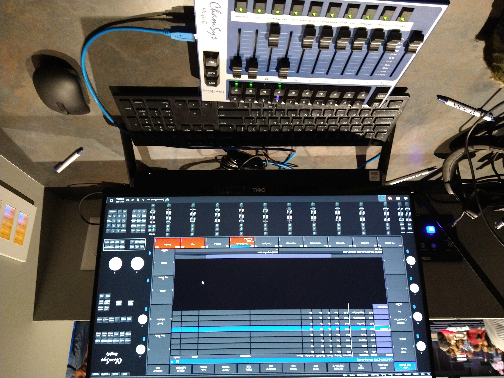
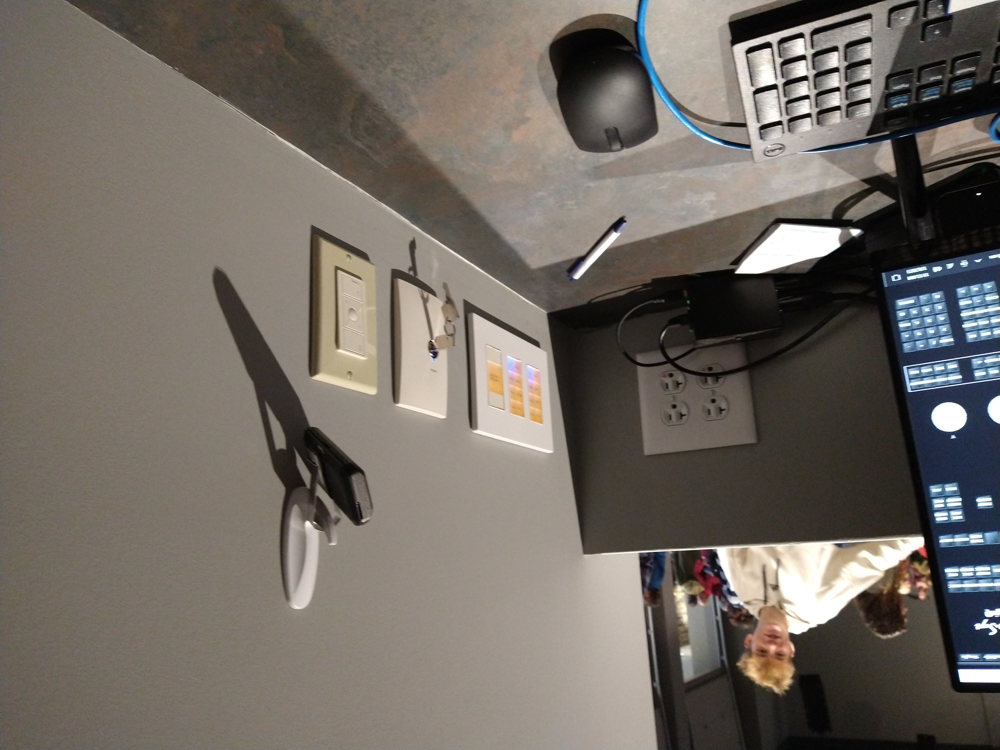
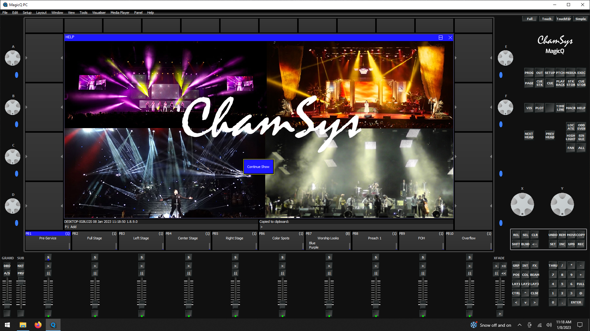
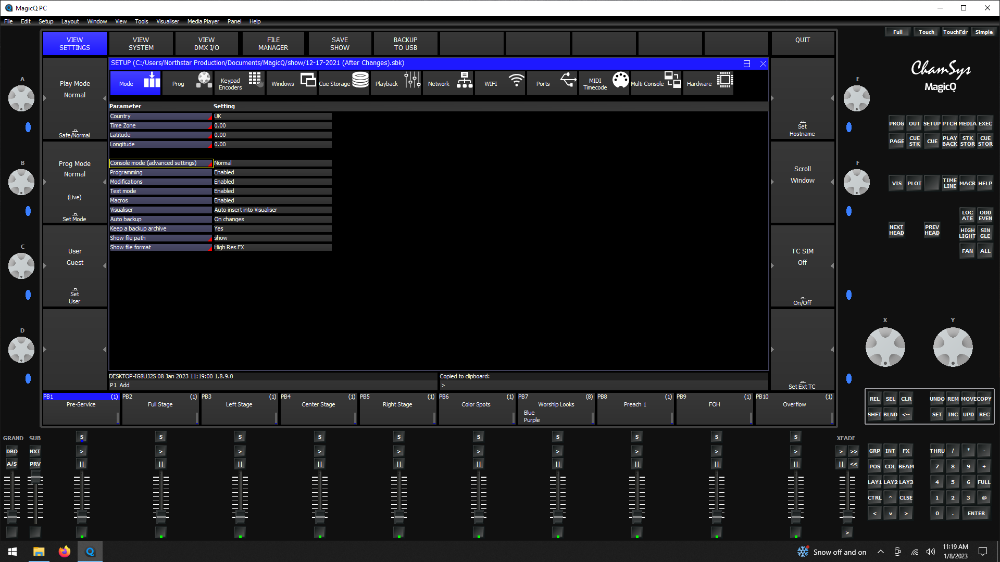
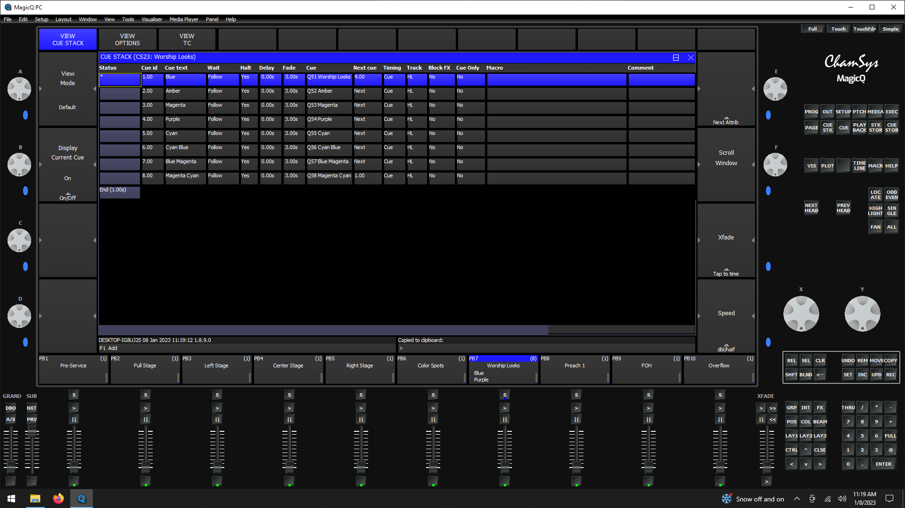
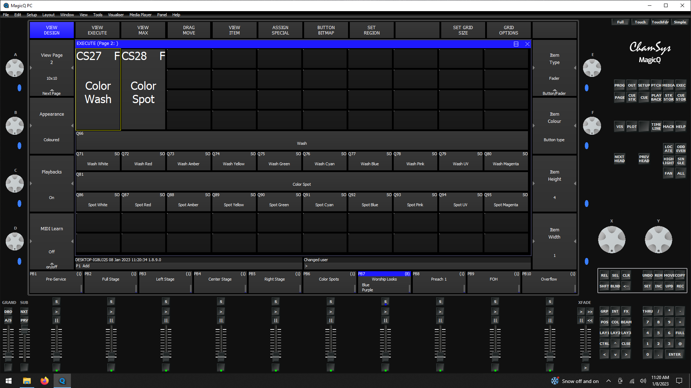

# Lighting Training
[Back to Overview](README.md)

This document is intended to serve as a training guide and reference 
document for AV volunteers controlling the lights at Northstar. 

## Table of Contents
- Responsibilities
- Physical Controls
- Setup and Teardown
- Typical Order of Service and Responsibilities
- Tips and Tricks

## Responsibilities
The lighting volunteer is responsible for the stage, auditorium, and overflow lights, ensuring that the congregation can view the goings-on onstage clearly and without distraction. Typically, the lighting volunteer is also responsible for opening and closing the garage doors leading into the house right side of the auditorium.
## Physical Controls
The controls which the lighting volunteer is responsible for and through which they will fulfill their role are the following:

- Garage door opener, hanging on a hook on the rightmost wall of the video and lighting booth
- In-wall light panels, on the rightmost wall of the AV booth
- Lighting console, stationed in front of the lighting computer
- Lighting computer, the rightmost workstation in the AV booth

The lighting volunteer should be familiar with the function and usage of each of these. 

### Garage door opener
This opener has three buttons which correspond to the three garage doors on the house right side of the auditorium. The buttons, labeled I-III, correspond in order to the doors from closest to stage to furthest from the stage. One push of the button starts moving the corresponding door to the opposite of its current position (an open door will begin to close, a closed door will begin to open, etc.). If in motion, a button push will stop the garage door. Another push will reverse it's motion from the last direction of travel. The doors are each equipped with blockage sensors approximately 3-4 inches from the ground. If any object crosses the line between the sensors while the door is closing, the door will stop closing and begin to open.

Frankly, it's a garage door. It's not that complicated.

### In-wall Light Panels
There are three relevant panels here, each on the right wall of the main AV booth, just above the surface of the desk. The button lit in blue for each of these is the active scene. Amber / orange back lighting indicates an inactive scene.  The panel closest to the front of the auditorium has three sets of buttons. The first, closest to the front of the auditorium, controls the auditorium house lights. It has settings for different levels of brightness and an 'off' button. Typically, the lights are on full except during service, when these lights are generally controlled from the console. **_Note: this panel has priority over the console, so the lights cannot be made dimmer than whatever they are set to on this panel from the console. This means the 'off' button should be selected before service to relinquish control to the console._** 

The next set of buttons controls the stage lights. It has a few common presets (or scenes) which are also represented on the console / lighting software. These are rarely used.  

The third set of (one) button(s) is a simple on / off switch for the overflow seating lights. Again, these are typically controlled from the console during service. 

The second, middle panel holds a lock-out key cylinder. There should be a keyring with two identical keys plugged into the cylinder. Do not remove these. If they aren't there, begin panicking as best as you know how. There is a small indicator light at the top of the cylinder. If the light is illuminated in blue, this indicates that the lockout is set, meaning the panels in the wall are inactive, and the lights can only be controlled from the console or lighting software.
> Just the front panel or the overflow, too?

If the blue indicator light is not illuminated, the lockout is off, and the lights can be controlled from the wall panel and the software / console. In this case the wall panels generally have priority, but the lighting console may still have some control. For example, if the lockout is off and the wall panel has the auditorium lights set at 50%, the lighting console / software can be used to change the lights to any power from 50%-100%, but cannot lower the light level below 50%. 
Before service begins, it is the best practice to set the wall panels as appropriate to give the console control and to set the lockout to avoid accidental or wayward button presses from changing the lights unexpectedly. 

The third panel is a dimmer switch that provides control over a set of LED lights set up at the back of the stage. These can be useful for providing a little additional light for volunteers working on stage if the stage lights are off / too dim. These should be off during service. Two notes on this: 1) There is also a control panel on stage in the wings, so people on stage can mess with these, too 2) These lights are LEDs, so they are not capable of dimming. The only relevant buttons, then, are the top ('on') and bottom ('off') buttons. The lights will flicker randomly when turned on or off. This is normal. A dimmer panel was used for this in construction for perfectly good and not at all irrational reasons or merely for convenience. In order to master or even understand the Tau of AV, you must embrace the chaos and occasional appearance of irrationality.

### Lighting Console

The Lighting Console (Mini Wing) consists of 10 sliders, each with an associated play cue button and some other button, which I don't know what they do, in addition to the main power slider and buttons. The main power slider and blackout button are disabled (for good and rational reasons). 

The main cues used in Sunday worship are PreService, Worship Looks, Preach 1, FOH (Front Of House, the main auditorium lights), and Overflow. The FOH and Overflow lights together control the auditorium lighting, and should be moved in sequence, whenever the overflow portion of the auditorium is open. The rest of the sliders correspond to stage lights. For those mentioned above, fading the sliders up from 0% also has the effect of firing the cue, which fade the lights from their previous colors and brightnesses to the selected cue. 

In brief, the usage of the lights during an ordinary service include: managing the auditorium lights brightness as described in [Typical Order of Service and Responsibilities], using PreService before the start of the service (optional), and switching between Preach and Worship as appropriate. The Worship Looks cue has a list of 8 preset lighting looks for worship. These are the nearly exclusive stage worship lights. The cue can be advanced to the next look by pressing the play button above the Worship looks slider. Pressing multiple times can be used to skip through to the desired cue usually without disturbing the colors due to the 3 second fade time. Note the if the Worship Looks slider is turned, to zero, fading the slider on again will restart the cue at the top, with Blue.

Note that it is preferred to fade off whichever of Preach or Worship is not in use due to differences in the general brightness of the stage in different parts for these two looks, so it is not just the color of the lights that are different. Fading the sliders very low can also be effective, which can allow the lighting volunteer to save the place in the Worship Looks cue if desired. 

The other sliders: Full Stage, Left Stage, Center Stage, and Left Stage can be used to add more brightness to the stage as desired. The Color Spots slider can be used to control the brightness of the colored spot lights at the back of the stage. These give a subtle effect, and should not be used for changing the brightness on stage. These are rarely used. 

### Lighting Computer (and associated software)
The computer at the lights station has the MagicQ software, which controls the lights. The lights for service can be completely controlled from either the software or the console, though generally a combination of the two is most useful. On startup, click 'Continue Show' to get to the main software.  The landing screen will be the general settings view. On the left side of the screen, there are four buttons. One is labeled 'User'.  To change to admin user, press this button and enter the admin password. [I imagine we won't want to put the password in such a public space as the training doc, in general, but probably everyone trained will know it]. This allows greater user control, most notably the ability to skip to any cue on the 'Worship Looks' stack. 

Along the bottom of the screen, there are a row of virtual sliders that match those on the lighting console. These function in the same manner as the console sliders, but are less commonly used. You can view the worship looks cue by double-clicking on the colored rectangle above the virtual slider labeled 'Worship Looks'.  Here you can view the order of the cue stack and, if logged in as admin, select the grey rectangle to the left of any cue, then press the 'Go to cue' button along the top of the screen to fade immediately to that cue. 

You can also change the colors of the color spot and color wash lights independently to achieve a different color scheme than the preset looks. The color wash are the most prominent lights, and generally define the color of the stage. 
> Check this 

The color spot lights can add a subtle change of color. On the right side of the screen, there are several groups of buttons. In the top group on the upper right corner, find the 'exec' button. This will change the main screen to a selection of buttons whereby you can independently change the wash and spot colors to get a custom look.  Note that you should already be on a 'Worship Looks' cue, as this will set the levels of brightness and white lighting appropriately. All the colors should be set to a 3-second fade to change, but I don't think all are. Note that these buttons are binary switches, and the colors will appear 'on' until turned 'off', but advancing the worship cue or selecting another color should override this. At the end of the shift, you can close the MagicQ software and shut down the computer. 
> Check this 

## Setup and Teardown
### Setup / Before Service
- Set the main auditorium lights to 90-100%
- Ensure the main lights power is on. This is located on the main control panel, on the left side of the AV booth at the projection station, beneath the secondary monitor. There is a row of rectangular buttons, illuminated red when off, white when on. Push the 'Lights Power' button to turn them on. 
- If the band is already setting up / practicing and needs lighting, turn on the auxiliary work lights with the dimmer switch panel and / or turn on some lights on the stage with the stage lights panel. Note that the main lights power will need to be on for this to work. (not for the auxiliary work lights)
- Turn on the lights computer. No password is necessary. Start up the lighting software. Press 'Continue Show' when the software initializes. Log in as admin if relevant. (Settings -> General -> User)
- At this point, lighting control though the panel and software is available. It is recommended that either now or at some point before the service, the in-wall light panels are set to off and the lockout is set.
- Determine lighting colors for the worship songs. 
- Optional: set the stage lighting to 'Preservice'. You may also just set them to the first song color.

### Teardown / After Service
- Turn off the lockout.
- Leave some sort of stage lighting on until the band / volunteer workers are done on stage. If you wish to shut down the lighting computer, you may use the in-wall panels to provide stage lighting while doing so. 
- *Set the auditorium lights to 100% (in most cases)* You will want to do this before shutting down the lighting computer, but it is best practices to do it immediately after service to avoid accidents. 
- Ensure that the lockout is off and the stage and auditorium lights are set to a reasonable setting using the in-wall panels, then close the lighting software and power off the lighting computer. Move all the sliders on the lighting console to the bottom position (off, 0%).
- When stage work is done, turn off all remaining stage lights using the in-wall panels. Leave the auditorium lights on if anyone remains in the auditorium. These are generally turned off while closing up the church. 
- Ensure everything (besides the main auditorium lights) is off, the garage door opener is returned to it's hook, and the lockout is off.
- You're done! The main lighting power is generally turned off by the projection volunteer at the end of their shift. 

## Typical Order of Service and Responsibilities
- Immediately before service: auditorium lights should be at 90-100%. Stage lights should be on, set to preservice or lighting colors for the first song. 
- First song: dim auditorium (and overflow) lights to ~40%. Turn worship lights on to 90% and to the appropriate color. 'Preach', 'Pre-Service', and all other lights (other than auditorium / overflow lights) should be off. 
- As first song ends / announcements begin: Fade 'Preach' setting on to 90% and 'Worship' setting off or very low. Bring auditorium / overflow lights to ~70%. 
- Greeting time: leave auditorium / overflow lights up (at least 70%). Close the garage doors as soon as the coast is clear and you won't be interrupted by pedestrians. You may change to the worship lights and turn 'Preach' lights off whenever. If you're really good, as the band is getting ready to / calling people back to worship, fade down the auditorium lights to worship setting (40%) to help get people to stop talking and find their seats already. 
- Second song: ensure lights are on worship ('Preach' off), and at the right color and power (90% stage (worship) / 40% auditorium).
- Third song: change to the correct color. Maintain 90/40 brightness.
- As the pastor comes up: Fade to 'Preach' lights at 90%. Fade worship off or very low. Fade auditorium lights up to ~65-70% (generally after opening prayer).
- Message: maintain 90/40 brightness.
- Ending song: Fade 'Worship' setting to 90% and 'Preach' off. Fade auditorium lights to 40%.
- End of closing prayer: fade auditorium lights to 90-100%. You may leave the last worship setting on while the band tears down. 

> If there is a video, generally leave the auditorium lights wherever they're set, but fade whatever is on stage lower to avoid washing out the screen. You may need to fade these lower if the auditorium lights are brighter. 

## Tips and Tricks
- Leave the worship looks on very low instead of fading the slider to 0 while using the preach setting to avoid having to reset at the top of the cue (useful when targeting a look later in the cue after a transition from 'Preach' _and_ while not logged in as admin).
- The general strategy for the garage doors is to close them during the greeting time while people are talking and open them at the end of the service during a crescendo of the last song (the least distractive moments possible).
- The normal approach to the garage doors can be disrupted if there is no greeting time, there happens to be a baptism, or the last song isn't very big. In these cases the doors will usually close during the second song and reopen after the service ends, but please check the provided order of service for specific door cues.
