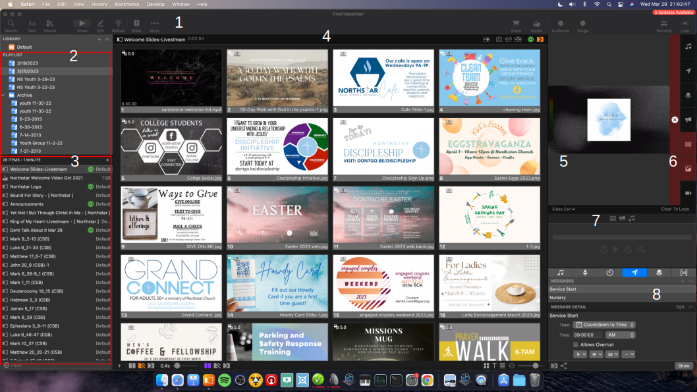
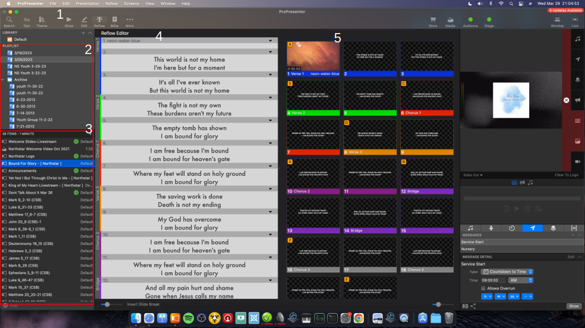
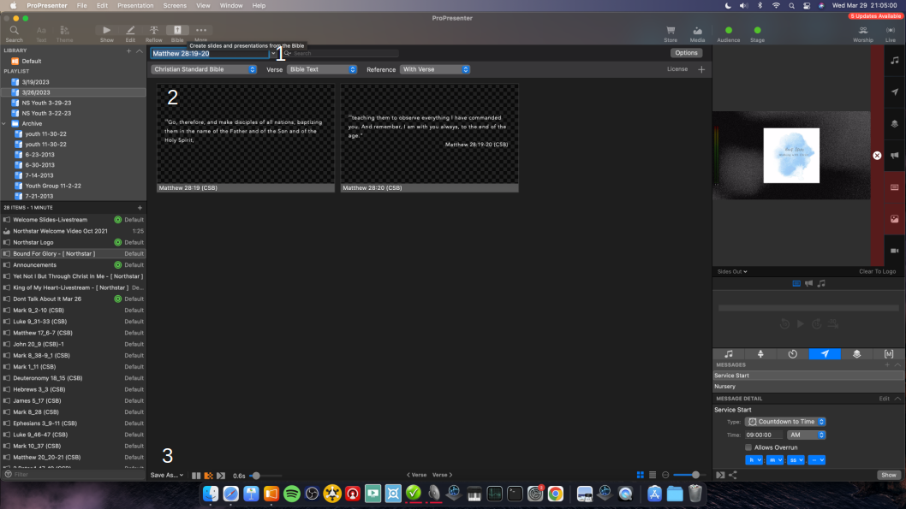
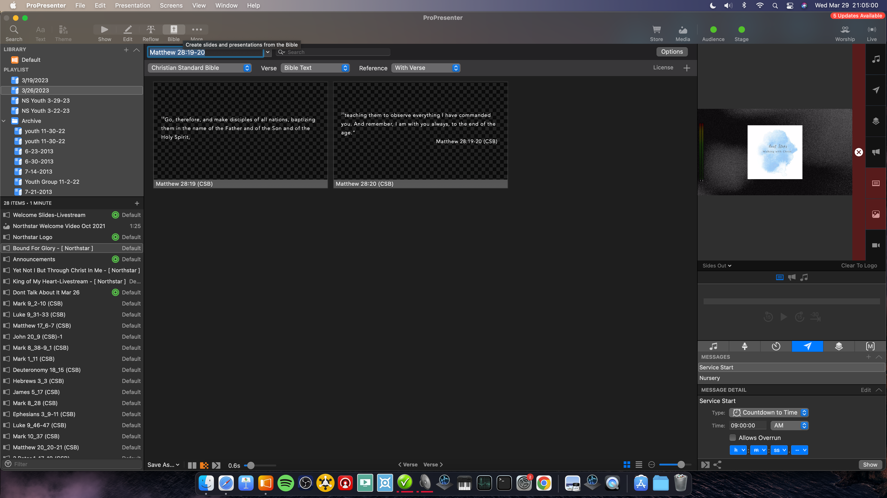
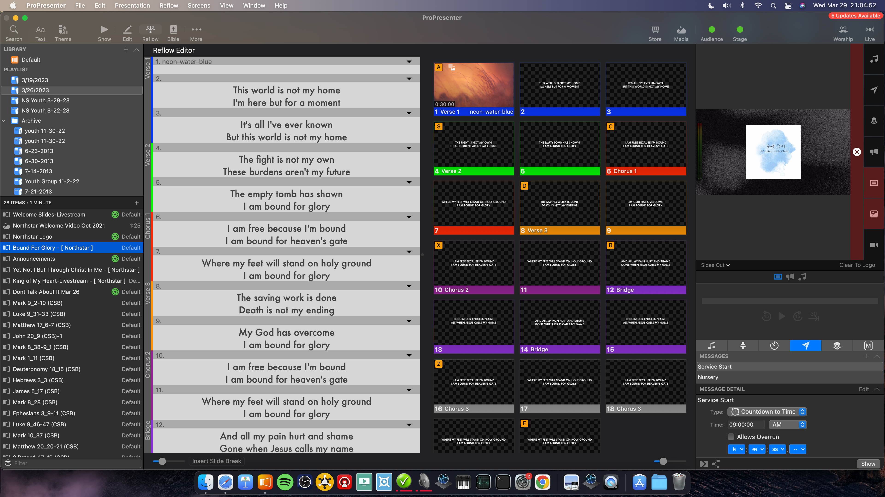

# Projection Training

[Back to Overview](README.md)

## Table of Contents

-   Responsibilities
-   Physical Controls
-   Setup and Teardown
-   Typical Order of Service and Responsibilities
-   Tips and Tricks

## Responsibilities

The projectionist is responsible for starting, managing, and ending the livestream and for the media shown on the projector screens. The media should be clear and helpful for the audience and not distracting. This includes setting up the media for the day in ProPresenter.

## Physical Controls

The controls which the projection volunteer is responsible for and through which they will fulfill their role are the following:

-   Presentation computer
    -   ProPresenter software
    -   UltraStream (interface through browser)
-   Power controls
-   Three main projectors
-   Rear-facing confidence monitor projector

### Presentation Computer

Used to interface with the ProPresenter software, UltraStream streaming device, and YouTube (if necessary).

Things to take note of in the ProPresenter software: the Playlist listing to the left side (where each event's data is stored), the Items listing just below (contains items and media for the selected playlist), the four main mode buttons at the upper left of the main view panel (Show, Edit, Reflow, and Bible), the main viewing window (center), and the preview feed and media clearing buttons (right sidebar).

### Power Controls

Four buttons controlling power to 1) the booth and equipment inside, 2) the stage lighting 3) the TVs in the overflow section / multipurpose room / GAP room, and 4) the projectors

### Three Main Projectors

The two side projectors show the same images, distinct from the center projector. The power is controlled by the power button mentioned above.

### Confidence Monitor

A rear-facing projector for the people on the stage to see what's on the projectors. Power is controlled by the same power button as the other projectors. The short, stubby remote corresponds to this projector; occasionally the signal is lost (commonly when the projectors are power-cycled): you can just switch the input and change it back to re-lock on the video feed.

### Overview of ProPresenter Software

1. Mode buttons: 'Show' is the general view depicted in this screenshot, 'Edit' is for modifying media and slides and is not often used, 'Reflow' is used to edit text-bases slides such as song lyrics or scripture texts, and 'Bible' is used to generate text slides with scripture verses on them.
2. Playlist menu: contains playlists and the archive of playlists.
3. Playlist contents: shows the items in the selected playlist
4. Main content area. This shows, in the playlist order, a continuous view of the items in the playlist. This will include image slides, text slides, songs, etc. Here, Sunday morning announcements are shown, which are image slides.
5. Output preview buttons.
6. Clear buttons. The tall button with the 'x' icon clears everything from the screens, the megaphone clears 'Announcement' objects (with the green concentric circle icons), the 'text box' icon clears text from the screen (song lyrics, scriptures, etc.), the 'image' icon clears media (backgrounds, videos, image slides that are not marked as announcements), the paper-airplane icon clears messages (usually just the pre-service countdown timer). The others are generally not used.
7. Dropdown menu to preview media play information and outputs for the various projectors. See #5.
8. This menu contains the pre-service timer (shown) and a few other less-commonly-used options.

1. Mode selector buttons.
2. Playlist menu: contains playlists and the archive of playlists.
3. Playlist contents: shows the items in the selected playlist
4. Reflow editor. The text-based slides can be edited here. To create a new slide, use the option + enter shortcut.
5. Reflow preview. Preview files or slides that are being edited.

1. Input box. Enter the desired reference with full name of the book and chapter:verse1-verse2.
2. Generated scripture slides.
3. 'Save as' menu. Select 'Add to playlist' and add add the slides to the desired playlist.

### Overview of UltraStream

-   To log into UltraStream, open Safari and navigate to the local UltraStream interface (start typing 'ultrastream', the browser should offer an auto-complete option. It is saved as a bookmark as well.) The login information is saved by the browser.
-   To begin streaming, press the square green 'Live' button on the landing page. The red 'Record' button should also generally be used. You may need to navigate to the 'storage' menu on the left sidebar and delete older recordings to make space. Be sure to stop recording and livestreaming a few minutes after the services is over.

### YouTube

-   YouTube is not generally necessary, as the stream is automatically set to start as soon as a data stream is received (UltraStream starts streaming). However, opening the church YouTube channel is the best practice as it allows you to monitor the stream and any comments.
-   Open Safari and navigate to the Northstar Church YouTube channel.
-   The dontgo.be/livestream shortcut can generally be used to access the first livestream event (if there are multiple services), while subsequent ones can be accessed from the channel page.
-   If the stream doesn't start appropriately, communicate with a church YouTube administrator (Ezra, Matt, or Jeff).

## Setup and Teardown

### Setup / Before Service

-   It's best to arrive around the same time as the band in order to prepare the presentation files and check the ordering of the worship lyrics (nominally an hour and a half or two hours before the first service).
-   Turn on the main power: Booth Power, GAP Room TVs, Lights Power, and Projector Power. Power on the presentation computer and open ProPresenter, if not already running.
-   Ensure that all the files and songs are in the playlist for the week. You should receive an email from whoever is preaching with the scripture references and any slides or videos for the week. Download these and add them to the playlist for the service. For the slides, add a new presentation (File -> New -> Presentation; or Cmd+n), ensuring you add the new presentation to the playlist for the service (dropdown menu in the window for creating a new presentation). Copy the downloaded slides into this new presentation and delete the default empty slide at the beginning of the presentation.
-   If you need to add a song: click the magnifying glass icon or use Cmd+f to open the search menu. A the top, there are three icons: the first searches songs existing in the local library, and is preferred. Clicking the middle icon opens SongSelect, which searches available songs to automatically create lyric slides.
-   After adding both the sermon slides and the song lyrics, make sure the appropriate macro action is added to the first slide of each (on the title slide for sermon slides and the motion background for songs). To do this, right click the first slide, choose the macro menu, and then select either "sermon" or "slides" as appropriate.
-   Add the scripture references. Click "Bible" on the upper right portion of the ProPresenter widow. Enter the scripture references in the text box to find the verses. The reference should be entered with the full name of the book, then `chapter`:`verse1`-`verse2`. At the bottom of the window, press save to playlist, then select the current playlist. Do this for all the references.

-   After adding the scriptures, ensure that there are no more than 3-4 lines per slide, to avoid interfering with the livestream's video feed. Select the scripture playlist, then go to the "Reflow" view, and press option + enter to break scripture onto a new slide. You can press delete while at the beginning of a slide to combine slides.

-   While the band is practicing, check that the lyrics are in the proper order for the song. For each song, press the "Arrangement" button that looks like three squares laid out horizontally at the right end of the banner along the song lyrics. Then, select the "Northstar" arrangement from the dropdown menu to the left. If the "Northstar" arrangement does not exist, create it. In general, you should be able to address any issues with the lyrics by dragging-and-dropping the lyric groupings into the current arrangement or removing unnecessary groups.
-   If the lyrics are oddly sized or aren't capitalized uniformly, apply our preferred default formatting. Select the song group in the playlist menu. Click the 'Text' button at the upper left part of the screen, near the search button. Apply the following formatting choices and click OK: Font: Futura, Weight: Medium, complete capitalization (the 'AA' button), and a font size of 60 (sometimes this may be modified, this is usually / approximately the best selection). You may also need to remove text effects such as shadowing.
-   If the song doesn't have a background as its first slide, or if you wish to change the background, open the media bin (ctrl+v or View -> Media Bin). Find whatever background you want, then drag it into the song as its own slide: i.e. drag it between / before existing slides, not onto an exising lyric slide. Right click on the old background, if any, and click delete.

### Teardown / After Service

-   Return to the UltraStream interface and stop the livestream and recording. If you are also monitoring the livestream on YouTube, ensure the stream stops after a few minutes.
-   As soon as the crowds have sufficiently cleared, you can stop the outro slides and shut down the projectors, lights, GAP TVs, and booth power. You're good to go!

## Typical Order of Service and Responsibilities

-   Begin playing the pre-service slides before starting the livestream.
    -   Be sure to look out for obsolete slides (referring to events already past). Remove these as necessary.
    -   Check for timers: these look like a '5.0' in the upper left corner of the slide (this is narrowly visible). If this is not present, right click on the slide then select 'Add timer', and set to 5.0 seconds. Note: this does not apply to the 30-second video at the beginning of the slides, which should have a 0.0 second timer. Only the last slide should have the "Loop to beginning" box checked.
-   Start the service countdown timer (ideally at least 10 minutes before service starts). In the lower portion of the right sidebar, click on the Messages tab (paper airplane icon). Ensure the service start time is correct, then press 'Show'.
-   Start the livestream about 10 minutes before service begins: open a Safari browser window. Go to the UltraStream interface (start typing, and this should be offered as an autocomplete option, and as a 'favorites' page). The login information should be saved. Press "Live" to begin livestreaming. It's also good practice to press "Rec" to begin recording a backup feed.
-   As service begins, put up the Northstar logo on the middle screen and select the background (first slide) of the first song. A small block of text will appear with copyright song information. Advancing the slide will replace this with the first lyric slide. You can advance the slides with the arrow keys or click on the appropriate slide. On the right side of the screen, click the button with three parallel horizontal lines to clear the lyrics or text from the screen (which you may want to do during an extended instrumental section). Pressing the 'picture' icon will clear the background. Pressing the tall rectangular button with the 'x' icon will clear everything from the screens.
-   During announcements (after the first song), show the slides relevant to each announcement while they're being discussed.
-   During the message, show the relevant scriptures and slides as they are read / discussed. When no slides are being shown, the middle screen should have the Northstar logo displayed or the sermon series graphic. In general, if a slide is not being discussed, it is preferable to remove the slide so it is not a distraction. After showing a scripture, leave the last group of text showing for a few seconds, so note-takers can write the reference. Note that slides should be set as "Announcements" in order to show in the center screen: at the right side of the header for the slide presentation, press the button that looks like two concentric circles, then select "Announcement".
-   Generally, the offering is taken at the end of the message as the last song begins. Show the "Ways to Give" slide as the offering is being announced, and for ~30 seconds after.
-   After the end of the last song, play the outro slides and clear everything else off the screens.

## Tips and Tricks

-   When attempting to start the recording for the livestream, you may receive a message indicating that the UltraStream storage device is full. In this case, navigate to the 'Storage' menu from the left sidebar. Click 'More', then select a few of the oldest video recordings and delete them with the trash can button. You should be able to record again at this point.
-   The livestream event is usually set to go live on YouTube 10 minutes before service time when the stream feed is started from the streaming device (UltraStream). It is best practice, however, to open the church YouTube page to ensure the stream has started correctly, monitor the stream, and be able to see and respond to comments (comments are quite rare). Navigate to the church YouTube channel using Safari, or the dontgo.be/livestream short link.

-   TODO: Picture of the software with buttons labeled
