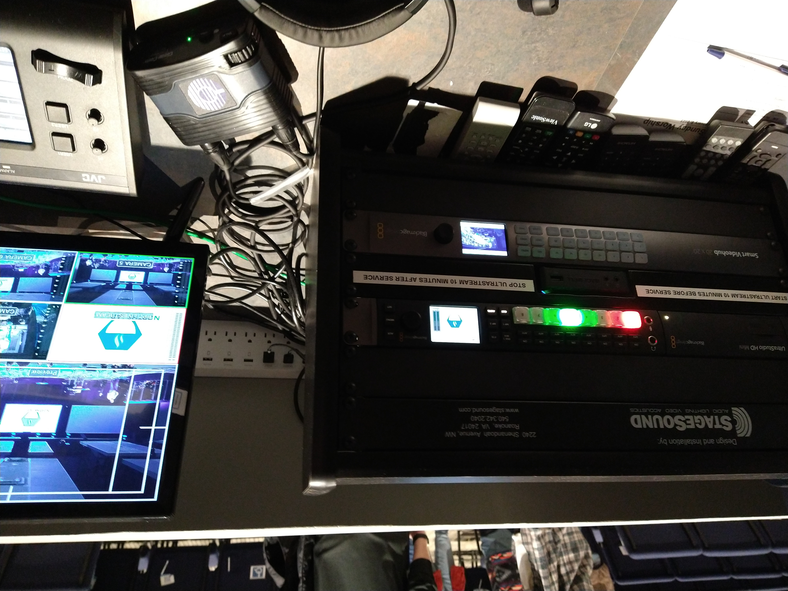
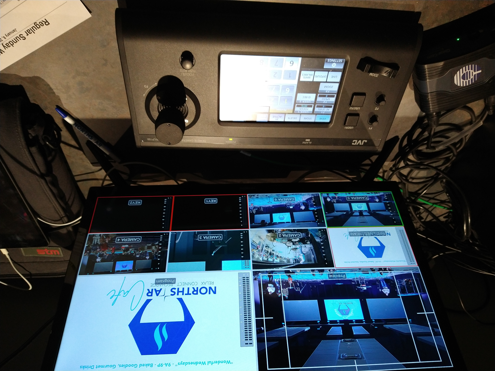

# Livestream Training
[Back to Overview](README.md)
## Table of Contents
- Responsibilities
- Physical Controls
- Setup and Teardown
- Typical Order of Service and Responsibilities
- Tips and Tricks

## Responsibilities
The live video or livestream volunteer is responsible for managing video feeds and production of the livestream and for controlling the remote-controlled cameras. They are responsible for ensuring the livestream is a smooth, professional, non-distracting, and engaging viewing experience, and is a passable reflection of in-person attendance to the degree this is possible. 

## Physical Controls
The controls which the lighting volunteer is responsible for and through which they will fulfill their role are the following:

- Video switcher
- Video chanel router
- Remote camera controls (two remote controlled cameras, currently)
- Two cameras on tripods

The production volunteer should be familiar with the function and usage of each of these. 

### Video switcher
- This consists of 8 buttons corresponding to different video feeds. The button lit in green is the active feed being sent to the output (this feed is visible on the to right panel of the video monitor) and the button lit in red indicates the selected feed which will be switched to the active feed if prompted (this feed is visible on the top left panel of the video monitor). 
- The 'auto' button fades between the selected and active video feeds. The 'cut' button switches abruptly between the feeds and should generally not be used.
- The lower half of the video monitor is dedicated to the 8 available video feeds. These match the 8 buttons labeled 1-4 on the top row and 5-8 on the bottom row. Only feeds 1-6 are used in the regular course of a service. 

### Video chanel patcher
This unit lies just below the video switcher and has three rows of buttons corresponding to video inputs and outputs. This can change the mapping between input and output channels. The function buttons include Menu, Video, Src, Dest, Clear, and Take. Menu has the eponymous function, Video changes the display window to show the video input of the selected input feed instead of just the input and output names. Src and Dest change the button functions to selecting either video source feeds or selecting video output feeds. In general, the procedure for switching an input feed is to 

1. Press Dest
2. Select the desired destination using the numbered buttons
3. With the desired destination (output feed) selected, press Src
4. Select the desired source feed using the numbered buttons
5. Once the source and destination are correctly selected, press Take to switch the input / output mapping of the selected feeds.
6. Press Clear at any time through this process to cancel. 

For example, one change that occasionally needs to be made is to switch between the media feed and the drum cam. The input for the video feed is 9 and the input for the drum cam is 16. The desired output is 2. To switch, press Dest, then 4, then source, then 9 / 16, then take. The video feed should switch on the monitor. 

### Remote camera controls (two remote controlled cameras)
The two remote cameras are controlled using the camera control console located in front of the video production monitor.

The two remote-controlled cameras are labeled 5 and 6. Camera 5 is located at the center back of the auditorium. Camera 6 is located just stage-left of center, near the middle of the auditorium front-to-back. The console controls both cameras; select camera 5 or camera 6 to control either camera. The main camera control is done with the joystick: pan left and right by moving the joystick left and right, control zoom by twisting the joystick knob clockwise (zoom in) or counter-clockwise (zoom out). The z-controls are inverted, so moving the joystick up will cause the camera to pan down, and vice versa. The zoom can also be controlled with the rocker switch on the left side of the control module. 

Note that these cameras __cannot__ rotate freely 360+ degrees, so if the camera is pointed directly backward, it must be rotated in the correct direction to face the stage again. 

The other settings (focus, white balance, etc.) are generally set to auto and are best left alone. These functions will not be covered in this document, but can be (cautiously) explored as necessary. The menu interface is fairly intuitive. 

### Two cameras on tripods
- Camera 4 is located at the front stage left corner of the booth. It typically provides a static wide shot of the full stage. 
- Camera 3 is located just to the right of the video switcher. This camera is generally used to focus a static shot of the worship leader or speaker. It can be pivoted, and the focus is controlled by a rocker switch the top of the camera. 

## Setup and Teardown

### Setup / Before Service
- Ensure the booth power is on __more on this__. 
- Turn on camera 3 and set to record (and is positioned correctly for the first song). If memory space will not sustain recording the services for the day, delete older video files until there is enough storage
- Turn on camera 4
- Send the welcome slide loop to the livestream feed before the livestream is started

### Teardown / After Service
- Play outro slides from the end of service until the crowd in the church begins to thin out
- Turn off camera 3 __Generally, I delete video files immediately, but this is probably poor general practice. My anal-retentive nature, I guess__
- Turn off camera 4
- The projection volunteer is generally responsible for turning off booth power

## Typical Order of Service and Responsibilities
- Send the welcome slides to the video output feed until service starts.
- Send the welcome video to the livestream feed.
- Switch video feeds as appropriate through the worship and message. 
  - Generally, switching approximately every 20-30 seconds during worship sets is reasonable, showing different parts or views of the band, and inlcuding panning shots as desired (see [tips](#tips-and-tricks)). 
  - If there are any videos during announcements, the message, or after the final song (a common time for showing baptism videos), be sure to feed the video input to the livestream.
  - Show a clear view of the person delivering announcements (generally camera 3 or 5), and briefly show the announcement slides as they are discussed. 
  - During the greeting time (if any), it's generally best to show a wide-angle shot from the back of the auditorium (camera 4 is great for this, although camera 5 can work as well).
  - During the message, cameras 3 and 5 are best to set up fairly close shots of the speaker. Be sure to watch out for them walking out of frame if they pace. Generally, switch video feeds only a few times over the course of the message, maximum every 5 minutes. 
  - Put up slides and visual aids briefly, but so that the livestream audience could follow and understand them as necessary. 
- Display the 'ways to give' slide briefly while the giving time is announced.
- Switch video feeds as described above during the last song. 
- Play the outtro slides after service ends until the church has mostly emptied. 

## Tips and Tricks
- Moving camera shots can be set up if done delicately. Start off by setting the camera to move __*slowly*__ in the desired direction (e.g. for a left panning shot, begin to move the camera slowly to the left). While maintaining the control stimulus, press the button on screen to switch control to the other camera and quickly release the control stimulus (e.g. if your moving shot is set up on camera 5, press the button on screen to begin controlling camera 6). The camera should continue in motion at a constant rate, and you can adjust the camera now selected for control witout interrupting the motion of the other camera. To stop the automatic motion, reselect the moving camera and move the camera opposite the direction of automatic motion. The camera is now fully under user control again. This tracking motion can be done with zoom movements as well. 